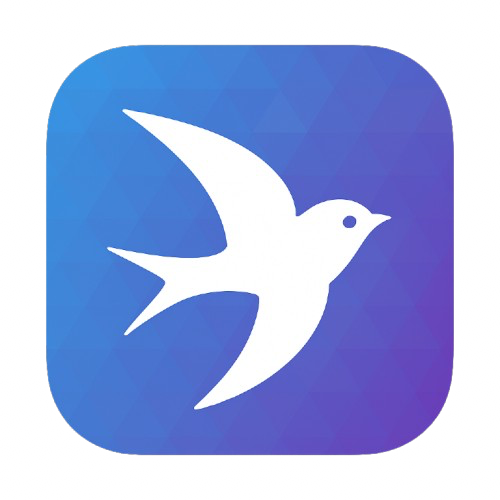

<h4 align="right"><strong>English</strong> | <a href="https://github.com/AprilNEA/ChatGPT-Admin-Web/blob/master/README_CN.md">
简体中文</a></h4>

    

<h1 align="center">AChat</h1>

<strong>An open-source/self-hosted/local-first AI platform, designed for enterprises and teams, perfectly combining powerful local processing capabilities with seamless remote synchronization.</em>.</strong>

  
  
  
  
  
    
  
  
  

[GitHub Sponsor](https://github.com/sponsors/AprilNEA) / [Afdian](https://afdian.net/a/aprilnea)

## Features

- 🌈 Customizable appearance
- 👻 Out-of-the-box user management
- 💰 Payment plan configuration, one-click interfacing to payment interfaces
- 🔐 Keyword filtering, replacement to ensure text security

## Start

For configuration and installation, see [documentation](https://manual.sku.moe/project/chatgpt-admin-web)

## Versions

| Version                                    | Status                               | Note |
| ------------------------------------------ | ------------------------------------ | ---- |
| [V4](https://github.com/AChatLab/AChat/tree/canary) | :white_check_mark: Under Development |      |
| [V3](https://github.com/AprilNEA/ChatGPT-Admin-Web/tree/v3)   | :o: No longer updated    | Refactor with modern tech stack |
| [V2](https://github.com/AprilNEA/ChatGPT-Admin-Web/tree/v2)   | :x: Deprecated                       | Flawed design                   |
| [V1](https://github.com/AprilNEA/ChatGPT-Admin-Web/tree/main) | :o: No longer updated                | Redis database, less scalable   |

[Update Log](https://manual.sku.moe/project/chatgpt-admin-web/update-log)

## 技术栈

| Part     | Tech               |
| :------- | :----------------- |
| Frontend | Next.js            |
| Backend  | Nest.js            |
| Database | PostgreSQL & Redis |

You can go to [Developer Manual](https://manual.sku.moe/project/chatgpt-admin-web/development) for more technical details.

## Project Status

News: [Telegram Channel](https://t.me/ChatGPTAdminWebChannel)*

## Contributors

## Star History

## Donate

Thank you for the inspiration to keep the program going.

[GitHub Sponsor](https://github.com/sponsors/AprilNEA)  |  [Afdian](https://afdian.net/a/aprilnea)

